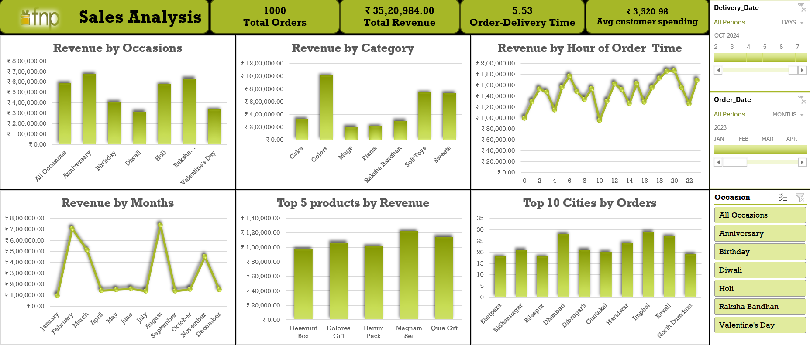

# Sales Analysis Dashboard

An interactive Excel-based Sales Analysis Dashboard designed to transform raw sales data into actionable business insights through dynamic visualizations, KPI tracking, and trend analysis.

---

## Project Overview

This project analyzes sales performance across different occasions, product categories, customer purchasing behavior, and regional markets. The dashboard enables businesses to monitor revenue trends, identify high-performing products, and make data-driven strategic decisions.

The solution was built using Microsoft Excel with Pivot Tables, Pivot Charts, KPI Cards, and Slicers to create a fully interactive reporting dashboard.

---

## Business Objectives

- Analyze overall sales and revenue performance
- Identify top-performing occasions and product categories
- Track customer purchasing behavior
- Monitor monthly and hourly sales trends
- Discover top-performing cities and products
- Enable interactive business reporting

---

## Tools & Technologies

- Microsoft Excel
- Pivot Tables
- Pivot Charts
- KPI Cards
- Slicers
- Data Cleaning & Transformation
- Business Intelligence Reporting

---

## Key KPIs

| KPI | Value |
|------|------|
| Total Orders | 1000 |
| Total Revenue | ₹35,20,984 |
| Avg Order-Delivery Time | 5.53 Days |
| Avg Customer Spending | ₹3,520.98 |

---

## Dashboard Features

- Revenue by Occasion
- Revenue by Category
- Revenue by Hour
- Monthly Revenue Trends
- Top Products Analysis
- Top Cities by Orders
- Interactive Filters & Slicers
- KPI Performance Tracking

---

## Key Business Insights

- Anniversary and Raksha Bandhan generated the highest revenue.
- Colors and Soft Toys were the best-performing product categories.
- Evening hours recorded peak customer ordering activity.
- February and August showed the strongest monthly sales trends.
- Imphal and Dhanbad generated the highest order volumes.

---

## Business Recommendations

- Increase marketing efforts during high-performing occasions.
- Maintain higher inventory for top-selling products.
- Launch targeted promotions during peak ordering hours.
- Strengthen campaigns in high-performing cities.
- Improve strategies for lower-performing categories.

---

## Dashboard Preview

### Full Dashboard



---

## Project Structure

```text
Sales-Analysis-Dashboard/
│
├── dashboard/
│   └── Sales_analysis_Dashboard.xlsx
│
├── dataset/
│   ├── customers.csv
│   ├── orders.csv
│   └── products.csv
│
├── insights/
│   └── Business_Insights_Sales_Dashboard.docx
│
├── screenshots/
│   └── sales_analysis_dashboard_image.png
│
└── README.md
```

---

## Project Outcome

This dashboard helps businesses:

- Monitor sales performance efficiently
- Identify profitable sales opportunities
- Understand customer behavior patterns
- Improve inventory and marketing strategies
- Make data-driven business decisions

---

## Author

Sanoop M

---

## Repository Purpose

This project demonstrates practical skills in:
- Data Analysis
- Business Intelligence
- Dashboard Development
- KPI Reporting
- Data Visualization
- Business Insights Generation
